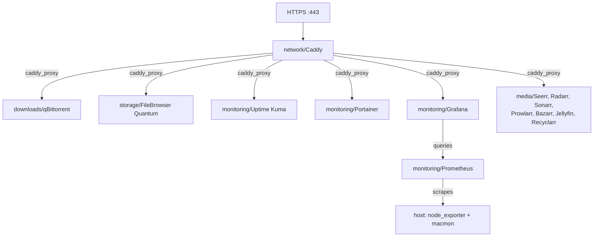

# Homelab Services

## Contents

- [Architecture](#architecture)
- [Prerequisites](#prerequisites)
- [Commands](#commands)
- [Service lifecycle](#service-lifecycle)
- [Adding a new service](#adding-a-new-service)
- [Startup order](#startup-order)
- [Data persistence](#data-persistence)
- [Manual setup steps](#manual-setup-steps-not-repo-managed)
- [Gotchas worth knowing](#gotchas-worth-knowing)
- [Future work](#future-work-intentionally-not-implemented)

Docker-based services managed by this repository. All configuration is templated — secrets and network-specific values come from Bitwarden via `.config.json`. Rendered files, persistent data, and runtime state live outside the repo.

## Architecture



- **DNS** is resolved by the router — no local DNS service needed
- **Caddy** terminates TLS using its own internal CA and reverse-proxies to services on the `caddy_proxy` network
- **App services** publish no ports — reachable only through Caddy
- Caddy is the only service that publishes ports to the host (80, 443)

## Prerequisites

- OrbStack installed (provides Docker)
  - On first install, OrbStack must be launched once via the GUI (Screen Sharing / VNC) to complete its initial setup.
  - OrbStack is a per-user GUI app, not a system daemon — it only starts after the `ops` user logs in. For unattended boot recovery (e.g., after a power outage), see [Auto-recovery after power loss](#11-auto-recovery-after-power-loss).
  - Docker CLI lives at `~/.orbstack/bin/docker` — interactive shells get it via PATH; non-interactive SSH (e.g., `ssh host 'docker ...'`) must use the full path.
- `.config.json` populated with `bw://` references (done during `ops-init`)
- Bitwarden vault unlocked

### Bitwarden fields (added to the existing `dotfiles/homelab/mac` item)

| Field                           | Purpose                                 |
| ------------------------------- | --------------------------------------- |
| `HOMELAB_IP`                    | Mac Mini static IP                      |
| `LAB_DOMAIN`                    | Internal domain                         |
| `SERVICES_DATA_DIR`             | Host path for persistent volumes        |
| `GRAFANA_ADMIN_PASSWORD`        | Initial Grafana admin password          |
| `TELEGRAM_BOT_TOKEN_MONITORING` | Token for the dedicated monitoring bot  |
| `TELEGRAM_CHAT_ID_MONITORING`   | Chat ID that receives Grafana alerts    |
| `MEDIA_ROOT`                    | Host path for media library             |
| `QBITTORRENT_PASSWORD`          | qBittorrent web UI admin password       |
| `RADARR_API_KEY`                | Radarr API key (for Recyclarr)          |
| `SONARR_API_KEY`                | Sonarr API key (for Recyclarr)          |

When creating `GRAFANA_ADMIN_PASSWORD`, note the following constraint:

> **Note:** the password is interpolated into a YAML Compose file via `envsubst`,
> so it should avoid YAML-special characters (`:`, `#`, `{`, `}`, `[`, `]`, `*`,
> `&`, `|`, `>`, `'`, `"`, `!`, etc.). Stick to alphanumeric plus safe symbols
> like `-`, `_`, `@` to avoid surprises at render time.

## Commands

```bash
dfs services list                # Show all services and status
dfs services init                # Init all services (first-time setup)
dfs services start               # Start all services (ordered)
dfs services stop                # Stop all services (reverse order)

dfs services init <name>         # Init a specific service
dfs services start <name>        # Start a specific service
dfs services stop <name>         # Stop a specific service
dfs services restart <name>      # Restart a specific service
dfs services status <name>       # Show detailed status
```

## Service lifecycle

`dfs services start <name>` performs these steps:

1. Resolve env vars from `.config.json` + Bitwarden
2. Ensure the shared `caddy_proxy` Docker network exists
3. Create the service's data directory under `${SERVICES_DATA_DIR}/<name>/`
4. Render all `*.tmpl` files in the service directory (`envsubst` substitutes `${VAR}` references)
5. Copy service-specific config into the data directory (if needed)
6. Render `caddy.snippet.tmpl` (if present) into `caddy/routes/<name>.snippet`
7. Reload Caddy (if running) to pick up the new route
8. `docker compose up -d`
9. Run `post-start.sh` if present

`dfs services stop <name>` runs `docker compose down`, removes the Caddy route, reloads Caddy.

## Adding a new service

1. Create a directory under `services/<category>/` named after the product (e.g., `monitoring/grafana/`)
2. Add a `docker-compose.yml.tmpl` — this is what defines it as a service
3. If web-facing, add a `caddy.snippet.tmpl` with the reverse proxy route
4. Add new Bitwarden fields to `.config.example.json` if the service needs them
5. Run `dfs services start <name>`

### Minimal service example

**`monitoring/my_service/docker-compose.yml.tmpl`**

```yaml
services:
  my_service:
    image: some/image:1.2.3
    restart: unless-stopped
    networks:
      - caddy_proxy
      - default
    volumes:
      - ${SERVICES_DATA_DIR}/my_service:/data

networks:
  caddy_proxy:
    external: true
```

**`monitoring/my_service/caddy.snippet.tmpl`**

```
my-service.${LAB_DOMAIN} {
	tls internal
	reverse_proxy my_service:8080
}
```

## Startup order

When starting all services, infrastructure comes first:

1. Caddy (reverse proxy)
2. Everything else (alphabetical)

Stop runs in reverse. Individual commands have no ordering.

## Data persistence

Each service stores persistent data in `${SERVICES_DATA_DIR}/<service_name>/`. This directory survives container rebuilds, restarts, and OrbStack reinstalls.

**What's repo-managed (source of truth):** templates, compose files, Caddy snippets, scripts.

**What's NOT in the repo:** rendered configs, persistent data, secrets.

## Manual setup steps (not repo-managed)

### 1. UniFi: wildcard DNS records

The UniFi router resolves `*.${LAB_DOMAIN}` natively. Add wildcard DNS records on the router pointing to the homelab IP — see [Media Stack DNS setup](media/README.md#dns-setup) for the specific records.

### 2. Trust Caddy's root CA on each device

Caddy generates its own root CA on first start. To access services via HTTPS without browser warnings, trust the CA on each device:

```bash
# On the homelab, extract the cert
ssh ops@homelab '~/.orbstack/bin/docker cp caddy:/data/caddy/pki/authorities/local/root.crt ~/caddy-root-ca.crt'

# On your Mac, fetch it
scp ops@homelab:/Users/ops/caddy-root-ca.crt ~/Downloads/

# Double-click the .crt — Keychain Access opens
# - Select "System" keychain (admin password)
# - Find "Caddy Local Authority" → double-click → Trust → "Always Trust"
```

For iOS: AirDrop the `.crt` file → Settings → Profile Downloaded → Install → Settings → General → About → Certificate Trust Settings → toggle on.

Trusting on the headless Mac Mini itself requires Screen Sharing (VNC) — `security add-trusted-cert` refuses to run in a non-interactive SSH session on macOS.

### 3. Uptime Kuma: create admin user and monitors

Visit `https://uptime.${LAB_DOMAIN}` and complete the setup. Monitor
configuration is stored in the service's SQLite DB (not repo-managed),
but the current monitor inventory is documented for restore purposes —
see [Monitoring README — Uptime Kuma monitor inventory](monitoring/README.md#uptime-kuma--monitor-inventory).

### 4. Portainer: first-run admin user

On first start, visit `https://containers.${LAB_DOMAIN}` and create the
admin user. Portainer closes the initial-user endpoint **5 minutes** after
the container starts for security reasons — if you miss the window, run
`dfs services restart portainer` to reopen it.

Portainer manages the local OrbStack Docker environment via the mounted
`/var/run/docker.sock`. No extra endpoint configuration is needed; the
local environment shows up automatically.

### 5. Native node_exporter (one-time, on the homelab)

`node_exporter` runs natively on macOS so it can read real host sysctl
metrics (Linux containers can't see the macOS host). It is installed by
`make ops-install` via the ops `Brewfile`. Start it once after install:

```sh
brew services start node_exporter
```

It listens on `127.0.0.1:9100` and is reached from inside Docker via
`host.docker.internal:9100` (Prometheus scrapes it there).

To verify after install:

```sh
curl -s http://127.0.0.1:9100/metrics | head -5
```

Expected: a few `# HELP …` lines.

### 6. Native macmon (one-time, on the homelab)

`macmon` monitors Apple Silicon hardware metrics (power, temperature,
CPU/GPU utilization, frequencies) and exposes them as Prometheus metrics.
Like `node_exporter`, it runs natively on macOS because it uses private
IOKit APIs that aren't available from inside containers. It is installed
by `make ops-install` via the ops `Brewfile`. Start it once after install:

```sh
macmon serve --port 9190 --interval 1000 --install
```

This registers a launchd agent that auto-starts on login, serving
Prometheus metrics on `127.0.0.1:9190`. Prometheus scrapes it via
`host.docker.internal:9190`.

To verify after install:

```sh
curl -s http://127.0.0.1:9190/metrics | head -5
```

Expected: a few `# HELP macmon_…` lines.

To uninstall the launchd agent: `macmon serve --uninstall`.

### 7. Telegram monitoring bot (one-time)

The Grafana alert pipeline uses a **dedicated** bot — separate from any
existing Uptime Kuma bot — so monitoring noise stays isolated from
reachability pings.

1. In Telegram, message `@BotFather`. Send `/newbot` and follow the
   prompts (e.g., name it `homelab-monitoring`). Save the HTTP API token
   into the Bitwarden field `TELEGRAM_BOT_TOKEN_MONITORING`.
2. Open a chat with the new bot from your Telegram account and send any
   message (e.g., `/start`).
3. From any machine, fetch the chat ID:

```sh
curl "https://api.telegram.org/bot<TOKEN>/getUpdates"
```

Find the `chat.id` numeric value in the JSON response. Save it into
the Bitwarden field `TELEGRAM_CHAT_ID_MONITORING`.

### 8. Grafana: first-run login

On first start, visit `https://monitoring.${LAB_DOMAIN}` and log in as
`admin` with the password set in `GRAFANA_ADMIN_PASSWORD`. The four
provisioned dashboards (Node Exporter Full, macmon Overview,
Prometheus Stats, Caddy Monitoring) appear under the "Homelab"
folder. There is no setup wizard.

Provisioned alert rules and the Telegram contact point appear under
**Alerting** in the left nav. To smoke-test the wiring, edit any rule
temporarily to a threshold you are currently exceeding (e.g., HostHighCPU
threshold to `1`); a Telegram message should arrive within ~1 minute.
Restore the threshold when done.

### 9. FileBrowser Quantum: first-run admin setup

On first start, visit `https://files.${LAB_DOMAIN}` and log in with the
default credentials `admin` / `admin`. Immediately:

1. Change the admin password (Settings → Profile Management)
2. Enable TOTP 2FA (Settings → Profile Management → Two-Factor Authentication)

User management and file permissions are configured through the admin UI.
Registration is disabled — create additional users manually if needed.

### 10. Media stack: downloads + media services

The media stack (qBittorrent, Prowlarr, Radarr, Sonarr, Bazarr, Jellyfin,
Seerr, Recyclarr) requires extensive first-launch configuration. See the
dedicated guide: [Media Stack README](media/README.md).

### 11. Auto-recovery after power loss

For the homelab to come back up unattended after a power outage, four
layers must all be in place. The Docker layer (compose `restart:
unless-stopped`) is repo-managed; the other three are macOS settings on
the Mac Mini that must be configured manually.

| Layer                     | What                                            | How                                                                                                                                                |
| ------------------------- | ----------------------------------------------- | -------------------------------------------------------------------------------------------------------------------------------------------------- |
| Hardware power-on         | Mac powers itself on when AC returns            | Run `sudo pmset -a autorestart 1`. Verify with `pmset -g \| grep autorestart` (expect `autorestart  1`).                                           |
| User session              | `ops` user auto-logs in (no GUI needed at boot) | **System Settings → Users & Groups → Automatically log in as → `ops`**. Requires FileVault to be **off** (verify with `fdesetup status`).          |
| OrbStack auto-start       | Docker daemon starts when `ops` logs in         | OrbStack menu bar icon → **Settings → System → Start OrbStack at login = ✅**. Or **System Settings → General → Login Items**, click **+**, add `OrbStack.app`. |
| Container restart policy  | Containers come back when Docker starts         | Already set: every compose template uses `restart: unless-stopped`. No action needed unless adding new services.                                   |

Verify after a reboot from your laptop:

```sh
ssh ops@homelab '~/.orbstack/bin/docker ps'
```

Should list running containers. If it errors with "Cannot connect to
the Docker daemon," OrbStack didn't start — re-check the login item.

Realistic recovery time after power restored: 1–2 minutes to all
Uptime Kuma monitors green.

## Gotchas worth knowing

### The `caddy_proxy` network is created by services.sh, not Caddy's compose

Services reference `caddy_proxy` as `external: true` in their compose files. `services.sh` creates the network via `docker network create` before starting any service, so all services (including Caddy) treat it as pre-existing.

### OrbStack on headless macOS

- Requires GUI launch once to complete initial setup
- Reopening the VNC session shows the login screen — the session locks when disconnected. Disable screen lock in System Settings → Lock Screen for a smoother experience.
- VNC "High performance" mode often fails on first connect to a headless Mac; drop to Adaptive, then switch via the **View** menu in Screen Sharing after connecting.

## Future work (intentionally not implemented)

- **Weekly Telegram digest** — a small script queries Prometheus for 7-day
  averages (CPU, memory, disk) and posts a text summary to the monitoring
  Telegram channel weekly via launchd. Deferred from the initial monitoring
  rollout. Spec lives at
  `docs/superpowers/specs/2026-04-13-grafana-prometheus-monitoring-design.md`.
- **Per-service exporter for Uptime Kuma** — same spec.
- ~~**Host temperature metrics via node_exporter textfile collector**~~ —
  superseded by macmon integration (provides CPU/GPU temperature and power
  metrics natively).
