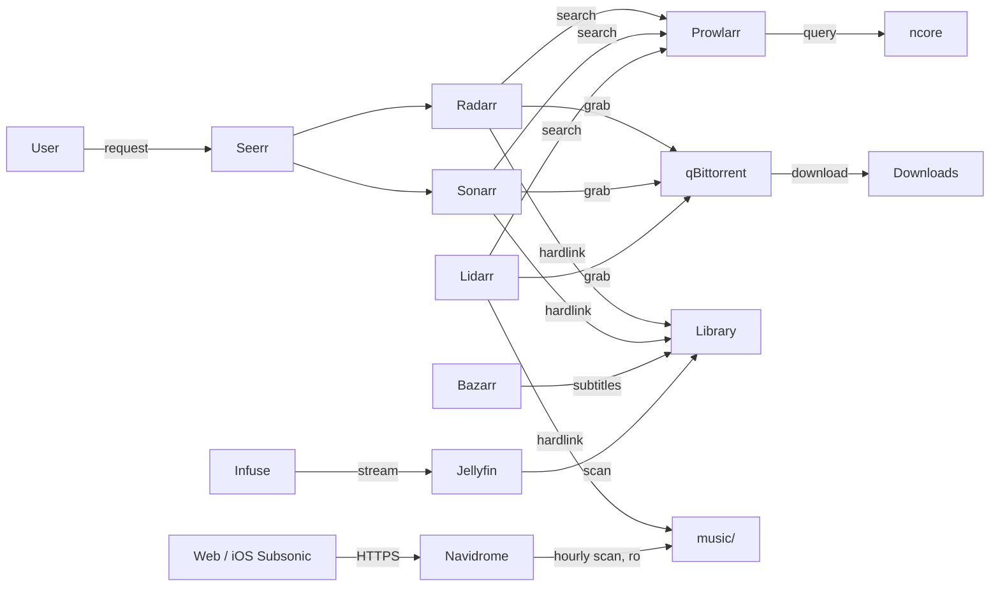

# Media Stack

Automated media server for requesting, downloading, organizing, and streaming movies and series. Content sourced from ncore.pro, streamed via Jellyfin + Infuse on Apple TV 4K. The stack also covers music: albums acquired by Lidarr from ncore, played through Navidrome via its web UI and iOS Subsonic clients, replacing Apple Music.

## Contents

- [Architecture](#architecture)
- [Services](#services)
- [Storage layout](#storage-layout)
- [DNS setup](#dns-setup)
- [First-launch setup](#first-launch-setup)
- [Quality profiles](#quality-profiles)
- [Apple TV setup](#apple-tv-setup)
- [Manual downloads](#manual-downloads)
- [Maintenance](#maintenance)
- [Future work](#future-work-intentionally-not-implemented)

## Architecture



## Services

| Service | Domain | Purpose |
|---------|--------|---------|
| Seerr | `media.${LAB_DOMAIN}` | Request UI (main entry point) |
| Radarr | `radarr.media.${LAB_DOMAIN}` | Movie management |
| Sonarr | `sonarr.media.${LAB_DOMAIN}` | Series management |
| Lidarr | `lidarr.media.${LAB_DOMAIN}` | Music management |
| Prowlarr | `prowlarr.media.${LAB_DOMAIN}` | Indexer manager |
| Bazarr | `bazarr.media.${LAB_DOMAIN}` | Subtitle fetching |
| Jellyfin | `jellyfin.media.${LAB_DOMAIN}` | Media server / library |
| Navidrome | `navidrome.media.${LAB_DOMAIN}` | Music server / player |
| qBittorrent | `downloads.${LAB_DOMAIN}` | Torrent client |
| Recyclarr | — | TRaSH Guides config sync (no UI) |

## Storage layout

All services that touch media files mount the same `${MEDIA_ROOT}` at `/media` to enable hardlinks (files stored once on disk, appear in two locations).

```
${MEDIA_ROOT}/
├── downloads/
│   ├── movies/          ← qBittorrent downloads here
│   ├── series/          ← qBittorrent downloads here
│   └── music/           ← qBittorrent downloads here
├── movies/              ← Radarr hardlinks completed movies here
├── series/              ← Sonarr hardlinks completed series here
├── music/               ← Lidarr hardlinks completed albums here
└── other/               ← manual (non-indexed) downloads live here
```

The `other/` folder is the [manual download lane](#manual-downloads) — content grabbed
directly from ncore without going through Prowlarr/Radarr/Sonarr/Seerr. qBittorrent
downloads straight into it (the seeding torrent *is* the library file), and Jellyfin
serves it as a read-only "Other" library.

`music/` is mounted read-write by Lidarr and read-only by Navidrome. Both music paths
sit on the same `${MEDIA_ROOT}` volume so hardlinks work between `downloads/music/` and
`music/` — the same rule as the video lane.

## DNS setup

Two wildcard DNS records on the UniFi router, both pointing to the homelab IP:

- `*.${LAB_DOMAIN}` → covers `downloads.${LAB_DOMAIN}`
- `*.media.${LAB_DOMAIN}` → covers all media service subdomains

## First-launch setup

After `dfs services start`, each service needs one-time manual configuration. Follow this order — later services depend on earlier ones.

### 1. qBittorrent

On first start, qBittorrent generates a random admin password and prints it to logs. Retrieve it, then visit `https://downloads.${LAB_DOMAIN}` and log in as `admin`:

```bash
docker logs qbittorrent 2>&1 | grep "temporary password"
```

1. **Settings → Web UI → Authentication**: change the admin password. Store the new password in Bitwarden field `QBITTORRENT_PASSWORD` on the `dotfiles/homelab/mac` item (for reference only — not used in templates).
2. **Settings → Downloads → Default Torrent Management Mode**: set to **Automatic** (required for category save paths to work)
3. **Settings → Downloads → Default Save Path**: set to `/media/downloads`
4. **Settings → Downloads → Keep incomplete torrents in**: leave disabled
5. **Create download categories** (left sidebar → right-click → "New Category"):
   - Category: `movies`, Save Path: `/media/downloads/movies`
   - Category: `series`, Save Path: `/media/downloads/series`
   - Category: `manual`, Save Path: `/media/other` (for the [manual download lane](#manual-downloads))
   - Category: `music`, Save Path: `/media/downloads/music`
6. **Settings → BitTorrent → Seeding Limits**: leave unchecked (seed indefinitely)

### 2. Radarr

Visit `https://radarr.media.${LAB_DOMAIN}`.

1. **First-run**: create an admin account
2. **Settings → General → API Key**: copy this key and save it to Bitwarden field `RADARR_API_KEY` on the `dotfiles/homelab/mac` item
3. **Settings → Media Management → Root Folders → Add Root Folder**: `/media/movies`
4. **Settings → Download Clients → Add → qBittorrent**:
   - Host: `qbittorrent`
   - Port: `8080`
   - Username: `admin`
   - Password: the password you set in step 1
   - Category: `movies`
   - Test the connection
5. **Settings → Profiles → Quality Profile** (whichever profile you use):
   - Language: set to **Any** (ncore tags dual-audio hun/eng releases as Hungarian — "Any" ensures they aren't rejected)
6. **Settings → Connect → Add → Jellyfin**:
   - Host: `jellyfin`
   - Port: `8096`
   - API Key: create one in Jellyfin (Dashboard → API Keys)
   - Test and save
   - This notifies Jellyfin immediately when new content is imported (no manual library scan needed)

### 3. Sonarr

Visit `https://sonarr.media.${LAB_DOMAIN}`.

1. **First-run**: create an admin account
2. **Settings → General → API Key**: copy this key and save it to Bitwarden field `SONARR_API_KEY` on the `dotfiles/homelab/mac` item
3. **Settings → Media Management → Root Folders → Add Root Folder**: `/media/series`
4. **Settings → Download Clients → Add → qBittorrent**:
   - Host: `qbittorrent`
   - Port: `8080`
   - Username: `admin`
   - Password: the password you set in step 1
   - Category: `series`
   - Test the connection
5. **Settings → Profiles → Quality Profile** (whichever profile you use):
   - Language: set to **Any** (same reason as Radarr)
6. **Settings → Connect → Add → Jellyfin**:
   - Host: `jellyfin`
   - Port: `8096`
   - API Key: same Jellyfin API key as Radarr
   - Test and save

### 4. Lidarr

Visit `https://lidarr.media.${LAB_DOMAIN}`.

1. **First-run**: create an admin account
2. **Settings → General → API Key**: copy this key and save it to Bitwarden field `LIDARR_API_KEY` on the `dotfiles/homelab/mac` item
3. **Settings → Media Management → Root Folders → Add Root Folder**: `/media/music`
4. **Settings → Download Clients → Add → qBittorrent**:
   - Host: `qbittorrent`
   - Port: `8080`
   - Username: `admin`
   - Password: the password you set in the qBittorrent step
   - Category: `music`
   - Test the connection
5. **Settings → Profiles → Quality Profile → Add**: name it `Lossless-first`
   - Allowed, highest first: **FLAC**, **MP3-320**, **MP3-VBR-V0**
   - Everything else: unchecked
   - Upgrades Allowed: yes, **Upgrade Until: FLAC**
6. **Settings → Profiles → Metadata Profile**: use the default (Studio albums only) unless you want singles and live records too
7. **Settings → Connect**: nothing to add — Navidrome has no notification integration, so new albums appear on its next hourly scan

Prowlarr registration is covered in the Prowlarr section below.

### 5. Custom formats (manual)

Recyclarr can only score TRaSH-managed custom formats. Language custom formats — used by the four quality profiles below — must be created in the Radarr/Sonarr UI before the first Recyclarr sync, and their per-profile scores must also be set manually after the profiles exist.

In Radarr (`Settings → Custom Formats → Add new` for each), use **Condition: Language**:

- `Hungarian` — Language = Hungarian
- `English` — Language = English
- `Original` — Language = Original

In Sonarr (same path):

- `Hungarian` — Language = Hungarian
- `English` — Language = English
- `Original` — Language = Original

The scores get set in step 7 (after Recyclarr creates the profiles).

### 6. Recyclarr

After API keys are in Bitwarden and language custom formats are created:

1. Re-render the Recyclarr config to inject the API keys:
   ```bash
   dfs services restart recyclarr
   ```
2. Run the first sync manually to verify:
   ```bash
   cd profiles/homelab/mac/ops/services/media/recyclarr
   docker compose run --rm recyclarr sync
   ```
3. Check that the four profiles were created in Radarr (`Settings → Profiles`): `4K HU`, `4K Any`, `HD HU`, `HD Any`. Same in Sonarr.

### 7. Configure each profile (Language + CF scores)

For each of the four profiles in **both Radarr and Sonarr** (`Settings → Profiles` → click profile):

1. **Language**: set to **Any** (Recyclarr cannot set this; required so ncore's Hungarian-tagged dual-audio releases aren't rejected on `* Any` profiles).
2. **Custom Formats**: set the language scores below.

In Radarr:

| Profile | `Hungarian` | `English` | `Original` |
|---------|-------------|-----------|------------|
| `4K HU` | 2000 | 0 | 0 |
| `4K Any` | 0 | 2000 | 2000 |
| `HD HU` | 2000 | 0 | 0 |
| `HD Any` | 0 | 2000 | 2000 |

In Sonarr (same shape as Radarr):

| Profile | `Hungarian` | `English` | `Original` |
|---------|-------------|-----------|------------|
| `4K HU` | 2000 | 0 | 0 |
| `4K Any` | 0 | 2000 | 2000 |
| `HD HU` | 2000 | 0 | 0 |
| `HD Any` | 0 | 2000 | 2000 |

### 8. Prowlarr

Visit `https://prowlarr.media.${LAB_DOMAIN}`.

1. **First-run**: create an admin account (username + password)
2. **Settings → Indexers → Add Indexer**: search for "ncore"
   - Enter your ncore username and password
   - Enter your ncore passkey (found in your ncore.pro profile under RSS/passkey section)
   - Test the connection
3. **Settings → Apps → Add Application → Radarr**:
   - Prowlarr Server: `http://prowlarr:9696`
   - Radarr Server: `http://radarr:7878`
   - API Key: paste the Radarr API key
4. **Settings → Apps → Add Application → Sonarr**:
   - Prowlarr Server: `http://prowlarr:9696`
   - Sonarr Server: `http://sonarr:8989`
   - API Key: paste the Sonarr API key
5. **Settings → Apps → Add Application → Lidarr**:
   - Prowlarr Server: `http://prowlarr:9696`
   - Lidarr Server: `http://lidarr:8686`
   - API Key: paste the Lidarr API key

### 9. Bazarr

Visit `https://bazarr.media.${LAB_DOMAIN}`.

1. **First-run**: create an admin account
2. **Settings → Sonarr**: connect to Sonarr
   - Address: `sonarr`
   - Port: `8989`
   - API Key: paste the Sonarr API key
   - Test and save
3. **Settings → Radarr**: connect to Radarr
   - Address: `radarr`
   - Port: `7878`
   - API Key: paste the Radarr API key
   - Test and save
4. **Settings → Languages**:
   - Languages Filter: add **English** and **Hungarian**
   - Languages Profile: click "Add New Profile", name it (e.g., "Default"), add **English** and **Hungarian**
   - Default Language Profiles For Newly Added Shows: check **Series**, select the profile
   - Default Language Profiles For Newly Added Movies: check **Movies**, select the profile
5. **Settings → Providers → Add**: configure subtitle providers
   - **OpenSubtitles.com**: create a free account at opensubtitles.com, add API key
   - **subdl**: good alternative for Hungarian subtitles
   - Enable any additional providers as desired

### 10. Jellyfin

Visit `https://jellyfin.media.${LAB_DOMAIN}`.

1. **First-run wizard**:
   - Create admin user (username + password)
   - Preferred display language: English (or Hungarian)
   - Skip "Setup your media libraries" for now — we'll add them next
   - Allow remote connections: yes
   - Finish wizard
2. **Dashboard → Libraries → Add Media Library**:
   - Content type: Movies
   - Display name: Movies
   - Folders: `/media/movies`
   - Preferred language: English
   - Country: Hungary
3. **Dashboard → Libraries → Add Media Library**:
   - Content type: Shows
   - Display name: Series
   - Folders: `/media/series`
   - Preferred language: English
   - Country: Hungary
4. **Dashboard → Libraries → Add Media Library** (the [manual download lane](#manual-downloads)):
   - Content type: Movies
   - Display name: Other
   - Folders: `/media/other`
   - Preferred language: English
   - Country: Hungary
5. **Dashboard → API Keys → Create**: create an API key for Radarr/Sonarr integration (used in their Connect settings)
6. **Dashboard → Scheduled Tasks → Scan All Libraries**: run manually for initial scan

### 11. Navidrome

Visit `https://navidrome.media.${LAB_DOMAIN}`.

1. **First visit**: the form shown creates the **admin** account. There is no
   separate wizard.
2. **Settings → Users → Add**: create one account per household member. The
   library is shared; play counts, ratings, stars and playlists are per-user.
3. **Transcoding** is server-side and chosen per player. Each client that
   connects registers itself under **Settings → Players**; set the phone
   entries to **Opus 128k** (or **AAC 192k** for clients without Opus) and
   leave the desktop browser on the original file. The transcoding cache is
   capped at 4GB and lives on the internal SSD, not the LaCie.
4. **iOS clients** speak the Subsonic API: Amperfy, play:Sub or substreamer.
   Server URL is `https://navidrome.media.${LAB_DOMAIN}`, with the account's
   username and password. The device must trust the Caddy root CA first — see
   [Trust Caddy's root CA](../README.md#2-trust-caddys-root-ca-on-each-device).
5. **Offline listening**: download albums inside the client. Nothing is exposed
   to the internet, so away-from-home playback is either pre-downloaded or over
   on-demand WireGuard.
6. **Scanning**: a full scan runs hourly (`ND_SCANNER_SCHEDULE`). Navidrome's
   real-time watcher is not relied on, because OrbStack bind mounts drop file
   events — the same limitation Jellyfin has here. To see a fresh import
   immediately, restart the container: `dfs services restart navidrome`.
7. **Backups**: the SQLite DB holding users, playlists and play counts is dumped
   nightly to `${SERVICES_DATA_DIR}/navidrome/backup`, keeping 7 copies.

### 12. Seerr

Visit `https://media.${LAB_DOMAIN}`.

1. **First-run wizard**:
   - Sign in method: choose Jellyfin
   - Jellyfin URL: `http://jellyfin:8096`
   - Sign in with your Jellyfin admin credentials
2. **Settings → Jellyfin**: libraries should be auto-discovered. Enable Movies and Series.
3. **Settings → Radarr**:
   - Default Server: yes
   - Server Name: Radarr
   - Hostname: `radarr`
   - Port: `7878`
   - API Key: paste the Radarr API key
   - Quality Profile: **4K Any** (the default for non-Hungarian content; override per-request as needed)
   - Root Folder: `/media/movies`
   - Test and save
4. **Settings → Sonarr**:
   - Default Server: yes
   - Server Name: Sonarr
   - Hostname: `sonarr`
   - Port: `8989`
   - API Key: paste the Sonarr API key
   - Quality Profile: **4K Any**
   - Root Folder: `/media/series`
   - Test and save

## Quality profiles

The stack runs four explicit profiles per service, strict on quality and soft on language:

| Profile | Quality (top → bottom) | Language preference |
|---------|------------------------|---------------------|
| `4K HU` | Remux-2160p, Bluray-2160p, WEB-2160p (+ HDTV-2160p in Sonarr) | Hungarian +2000 |
| `4K Any` | same as above | English +2000, Original +2000 |
| `HD HU` | Remux-1080p → Bluray-1080p → WEB-1080p → HDTV-1080p → Bluray-720p → WEB-720p → HDTV-720p | Hungarian +2000 |
| `HD Any` | same as above | English +2000, Original +2000 |

Each profile is **strict** on its quality tier — if a 4K profile finds nothing on ncore, manually re-assign the item to the matching HD profile. There is no automatic fallback inside a profile (avoids the case where a 1080p Atmos release outscores a plain 4K release).

Language preference is **pure-positive**: nothing is rejected. The `Any` profiles will grab a Hungarian-only release if no English release exists on ncore — re-search manually when this happens.

### Picking a profile

| Content | Profile |
|---------|---------|
| Hungarian movie/series, recent | `4K HU` |
| Hungarian movie/series, older (no 4K likely) | `HD HU` |
| Non-Hungarian, recent | `4K Any` |
| Non-Hungarian, older | `HD Any` |
| Anything where 4K search came up empty | switch to matching `HD *` profile |

### What's managed where

- **Quality tiers + TRaSH custom formats (HDR/DV, audio)** — configured in `recyclarr.yml.tmpl` and synced by Recyclarr
- **Language custom formats (Hungarian, English, Original)** — created manually in Radarr/Sonarr UI; Recyclarr cannot manage non-TRaSH formats
- **Per-profile language CF scores** — set manually in each profile's Custom Formats section (see "Set language CF scores per profile" in first-launch setup)

### Recyclarr sync

After editing `recyclarr.yml.tmpl`:

```bash
dfs services restart recyclarr
cd profiles/homelab/mac/ops/services/media/recyclarr
docker compose run --rm recyclarr sync
```

Recyclarr otherwise re-syncs daily via cron. See [Recyclarr config reference](https://recyclarr.dev/wiki/yaml/config-reference/) for the full syntax.

## Apple TV setup

Jellyfin exposes port 8096 directly (in addition to HTTPS via Caddy) so that Infuse on Apple TV can connect over HTTP without needing to trust the Caddy CA. Apple TV 4K has no USB-C port, making CA trust installation impractical.

### Configure Infuse

1. Open Infuse on Apple TV
2. Add Share → **Jellyfin**
3. Server: `http://jellyfin.media.${LAB_DOMAIN}:8096`
4. Sign in with your Jellyfin credentials
5. Libraries should appear automatically

Browser access at `https://jellyfin.media.${LAB_DOMAIN}` continues to work through Caddy with HTTPS as before.

## Manual downloads

Sometimes you want to grab something directly from ncore — a magnet or `.torrent`
link you already have — without indexing it through Prowlarr/Radarr/Sonarr/Seerr. The
`manual` lane exists for exactly this: qBittorrent downloads straight into
`${MEDIA_ROOT}/other`, and Jellyfin serves that folder as the read-only **Other**
library, so it shows up in Infuse alongside everything else.

Nothing about this touches the arr stack — no metadata match, no quality profile, no
request record. It's just "download this file and let me watch it".

### Per-use workflow

1. Open qBittorrent at `https://downloads.${LAB_DOMAIN}`.
2. Add the torrent:
   - **Magnet link**: top toolbar → *Add Torrent Link* → paste → **Category: `manual`** → Add.
   - **`.torrent` file**: top toolbar → *Add Torrent File* → select it → **Category: `manual`** → Add.
3. Wait for the download to finish. It lands in `${MEDIA_ROOT}/other/` and keeps
   seeding (good for your ncore ratio) — the seeding file *is* the library file.
4. It appears in Infuse under the **Other** library after Jellyfin's next library scan
   (see note below). To watch immediately, trigger a scan:
   **Jellyfin → Dashboard → Scheduled Tasks → Scan All Libraries** (or *Scan Library
   Files* on the Other library).

### Scan timing

Jellyfin's real-time folder monitoring can miss changes made through a macOS/OrbStack
bind mount, so don't rely on new files appearing instantly. The dependable trigger is
Jellyfin's scheduled library scan. If you want manual downloads to surface sooner
without a button press, shorten the interval at
**Dashboard → Scheduled Tasks → Scan Media Library → (edit trigger)** — e.g. every few
hours. Otherwise a manual *Scan All Libraries* is the one-tap way to see it right away.

### Removing manual content

Delete the torrent from qBittorrent. If you choose **"also delete the files"**, it
disappears from the Other library too (the file and the library entry are the same
file — there's no hardlinked copy, unlike the arr-managed folders). Keep the torrent to
keep seeding and keep it watchable.

### Music requests and ncore gaps

Seerr has no music support, so Lidarr's own UI is the request path: search an
artist, monitor it, and Lidarr grabs matching albums through Prowlarr.

ncore is a general Hungarian tracker — music coverage for niche or
international artists is thinner than for film. When a search comes up empty,
copy the files into `${MEDIA_ROOT}/music/<Artist>/<Album>/` yourself; Navidrome
picks them up on the next hourly scan regardless of what Lidarr knows. Lidarr
may later match those files to an artist you monitor; if you would rather it
never touch them, leave that artist unmonitored.

## Maintenance

### Disk space

qBittorrent seeds indefinitely. Completed torrents stay in `${MEDIA_ROOT}/downloads/` while hardlinked copies exist in `${MEDIA_ROOT}/movies/` and `${MEDIA_ROOT}/series/`. Since hardlinks share disk blocks, files are stored once.

To free space: remove old torrents from qBittorrent's web UI. The library copy remains (hardlink becomes a regular file when the download copy is deleted). The music lane seeds and hardlinks exactly like the video lanes, so the same rule applies there too.

### Moving to external HDD

The full procedure (drive prep, mount stability, hardlink-preserving copy, smoke tests, rollback) is documented in the design spec. The TL;DR:

1. Stop services that touch `${MEDIA_ROOT}` (qbit, arrs, bazarr, jellyfin, recyclarr, seerr).
2. `rsync -avH /Users/ops/HomeLab/media/ /Volumes/<NewDrive>/media/` — `-H` preserves hardlinks.
3. Verify file counts, sizes, and a sample hardlink chain on the destination.
4. Update `MEDIA_ROOT` in Bitwarden to the new path; `dfs services init && dfs services restart`.
5. Smoke-test qBittorrent (no "Missing files"), Radarr/Sonarr (free space reflects new drive), Jellyfin (library scan + sample play).
6. Wait a few days, then `rm -rf` the old `${MEDIA_ROOT}`.

**Before step 4, pre-grant OrbStack access to the new drive:** System Settings → Privacy & Security → Files and Folders → OrbStack → toggle on "Removable Volumes". The first container bind-mount under `/Volumes/` triggers a TCC prompt; if you're on SSH or the GUI is minimized, OrbStack's daemon will block waiting for consent and `docker ps` / `orb status` / `dfs services start` will all hang silently. If that happens mid-run, open the OrbStack GUI on the mini's display — the prompt is sitting there waiting for an Allow click.

See `docs/superpowers/specs/<latest-external-hdd-migration-design>.md` for the full step-by-step including macOS-specific gotchas (volume rename collision, ownership, Spotlight indexing, energy settings).

### Recyclarr updates

Recyclarr syncs TRaSH Guides daily via cron. To force an immediate sync:

```bash
cd profiles/homelab/mac/ops/services/media/recyclarr
docker compose run --rm recyclarr sync
```

## Future work (intentionally not implemented)

- **Grafana dashboard for Navidrome** — its native `/metrics` endpoint is
  scraped and queryable in Explore, but no dashboard is provisioned yet.
- **slskd + soularr as a second acquisition path** — the usual answer to thin
  torrent music coverage. Adds a service and a second download lane.
- **Lidarr → Navidrome scan webhook** — a Lidarr Connect custom script could
  trigger an immediate scan instead of waiting up to an hour. Needs a script
  that survives container rebuilds plus a Navidrome token.
