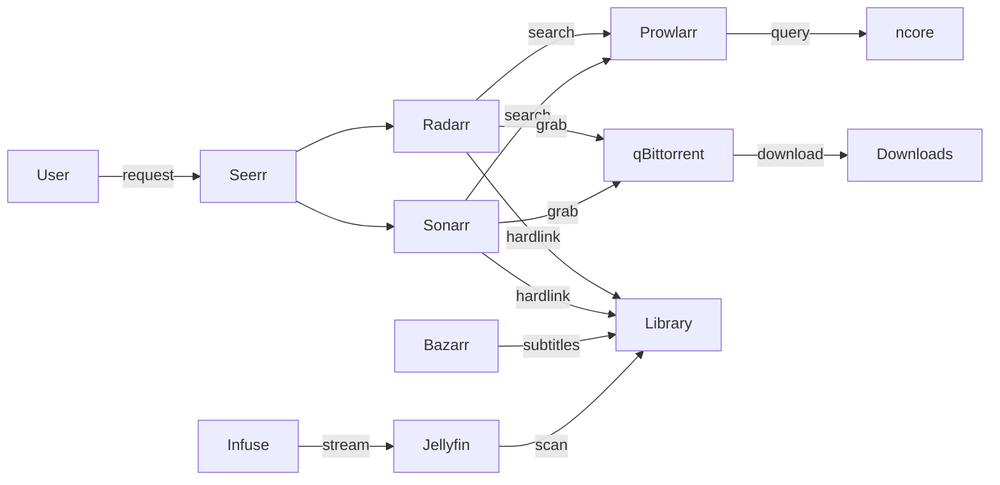

# Media Stack

Automated media server for requesting, downloading, organizing, and streaming movies and series. Content sourced from ncore.pro, streamed via Jellyfin + Infuse on Apple TV 4K.

## Contents

- [Architecture](#architecture)
- [Services](#services)
- [Storage layout](#storage-layout)
- [DNS setup](#dns-setup)
- [First-launch setup](#first-launch-setup)
- [Quality profiles](#quality-profiles)
- [Apple TV setup](#apple-tv-setup)
- [Maintenance](#maintenance)

## Architecture



## Services

| Service | Domain | Purpose |
|---------|--------|---------|
| Seerr | `media.${LAB_DOMAIN}` | Request UI (main entry point) |
| Radarr | `radarr.media.${LAB_DOMAIN}` | Movie management |
| Sonarr | `sonarr.media.${LAB_DOMAIN}` | Series management |
| Prowlarr | `prowlarr.media.${LAB_DOMAIN}` | Indexer manager |
| Bazarr | `bazarr.media.${LAB_DOMAIN}` | Subtitle fetching |
| Jellyfin | `jellyfin.media.${LAB_DOMAIN}` | Media server / library |
| qBittorrent | `downloads.${LAB_DOMAIN}` | Torrent client |
| Recyclarr | — | TRaSH Guides config sync (no UI) |

## Storage layout

All services that touch media files mount the same `${MEDIA_ROOT}` at `/media` to enable hardlinks (files stored once on disk, appear in two locations).

```
${MEDIA_ROOT}/
├── downloads/
│   ├── movies/          ← qBittorrent downloads here
│   └── series/          ← qBittorrent downloads here
├── movies/              ← Radarr hardlinks completed movies here
└── series/              ← Sonarr hardlinks completed series here
```

## DNS setup

Two wildcard DNS records on the UniFi router, both pointing to the homelab IP:

- `*.${LAB_DOMAIN}` → covers `downloads.${LAB_DOMAIN}`
- `*.media.${LAB_DOMAIN}` → covers all media service subdomains

## First-launch setup

After `dfs services start`, each service needs one-time manual configuration. Follow this order — later services depend on earlier ones.

### 1. qBittorrent

On first start, qBittorrent generates a random admin password and prints it to logs. Retrieve it, then visit `https://downloads.${LAB_DOMAIN}` and log in as `admin`:

```bash
docker logs qbittorrent 2>&1 | grep "temporary password"
```

1. **Settings → Web UI → Authentication**: change the admin password. Store the new password in Bitwarden field `QBITTORRENT_PASSWORD` on the `dotfiles/homelab/mac` item (for reference only — not used in templates).
2. **Settings → Downloads → Default Torrent Management Mode**: set to **Automatic** (required for category save paths to work)
3. **Settings → Downloads → Default Save Path**: set to `/media/downloads`
4. **Settings → Downloads → Keep incomplete torrents in**: leave disabled
5. **Create download categories** (left sidebar → right-click → "New Category"):
   - Category: `movies`, Save Path: `/media/downloads/movies`
   - Category: `series`, Save Path: `/media/downloads/series`
6. **Settings → BitTorrent → Seeding Limits**: leave unchecked (seed indefinitely)

### 2. Radarr

Visit `https://radarr.media.${LAB_DOMAIN}`.

1. **First-run**: create an admin account
2. **Settings → General → API Key**: copy this key and save it to Bitwarden field `RADARR_API_KEY` on the `dotfiles/homelab/mac` item
3. **Settings → Media Management → Root Folders → Add Root Folder**: `/media/movies`
4. **Settings → Download Clients → Add → qBittorrent**:
   - Host: `qbittorrent`
   - Port: `8080`
   - Username: `admin`
   - Password: the password you set in step 1
   - Category: `movies`
   - Test the connection
5. **Settings → Profiles → Quality Profile** (whichever profile you use):
   - Language: set to **Any** (ncore tags dual-audio hun/eng releases as Hungarian — "Any" ensures they aren't rejected)
6. **Settings → Connect → Add → Jellyfin**:
   - Host: `jellyfin`
   - Port: `8096`
   - API Key: create one in Jellyfin (Dashboard → API Keys)
   - Test and save
   - This notifies Jellyfin immediately when new content is imported (no manual library scan needed)

### 3. Sonarr

Visit `https://sonarr.media.${LAB_DOMAIN}`.

1. **First-run**: create an admin account
2. **Settings → General → API Key**: copy this key and save it to Bitwarden field `SONARR_API_KEY` on the `dotfiles/homelab/mac` item
3. **Settings → Media Management → Root Folders → Add Root Folder**: `/media/series`
4. **Settings → Download Clients → Add → qBittorrent**:
   - Host: `qbittorrent`
   - Port: `8080`
   - Username: `admin`
   - Password: the password you set in step 1
   - Category: `series`
   - Test the connection
5. **Settings → Profiles → Quality Profile** (whichever profile you use):
   - Language: set to **Any** (same reason as Radarr)
6. **Settings → Connect → Add → Jellyfin**:
   - Host: `jellyfin`
   - Port: `8096`
   - API Key: same Jellyfin API key as Radarr
   - Test and save

### 4. Custom formats (manual)

Recyclarr can only score TRaSH-managed custom formats. Language custom formats — used by the four quality profiles below — must be created in the Radarr/Sonarr UI before the first Recyclarr sync, and their per-profile scores must also be set manually after the profiles exist.

In Radarr (`Settings → Custom Formats → Add new` for each), use **Condition: Language**:

- `Hungarian` — Language = Hungarian
- `English` — Language = English
- `Original` — Language = Original

In Sonarr (same path):

- `Hungarian` — Language = Hungarian
- `English` — Language = English
- `Original` — Language = Original

The scores get set in step 6 (after Recyclarr creates the profiles).

### 5. Recyclarr

After API keys are in Bitwarden and language custom formats are created:

1. Re-render the Recyclarr config to inject the API keys:
   ```bash
   dfs services restart recyclarr
   ```
2. Run the first sync manually to verify:
   ```bash
   cd profiles/homelab/mac/ops/services/media/recyclarr
   docker compose run --rm recyclarr sync
   ```
3. Check that the four profiles were created in Radarr (`Settings → Profiles`): `4K HU`, `4K Any`, `HD HU`, `HD Any`. Same in Sonarr.

### 6. Configure each profile (Language + CF scores)

For each of the four profiles in **both Radarr and Sonarr** (`Settings → Profiles` → click profile):

1. **Language**: set to **Any** (Recyclarr cannot set this; required so ncore's Hungarian-tagged dual-audio releases aren't rejected on `* Any` profiles).
2. **Custom Formats**: set the language scores below.

In Radarr:

| Profile | `Hungarian` | `English` | `Original` |
|---------|-------------|-----------|------------|
| `4K HU` | 2000 | 0 | 0 |
| `4K Any` | 0 | 2000 | 2000 |
| `HD HU` | 2000 | 0 | 0 |
| `HD Any` | 0 | 2000 | 2000 |

In Sonarr (same shape as Radarr):

| Profile | `Hungarian` | `English` | `Original` |
|---------|-------------|-----------|------------|
| `4K HU` | 2000 | 0 | 0 |
| `4K Any` | 0 | 2000 | 2000 |
| `HD HU` | 2000 | 0 | 0 |
| `HD Any` | 0 | 2000 | 2000 |

### 7. Prowlarr

Visit `https://prowlarr.media.${LAB_DOMAIN}`.

1. **First-run**: create an admin account (username + password)
2. **Settings → Indexers → Add Indexer**: search for "ncore"
   - Enter your ncore username and password
   - Enter your ncore passkey (found in your ncore.pro profile under RSS/passkey section)
   - Test the connection
3. **Settings → Apps → Add Application → Radarr**:
   - Prowlarr Server: `http://prowlarr:9696`
   - Radarr Server: `http://radarr:7878`
   - API Key: paste the Radarr API key
4. **Settings → Apps → Add Application → Sonarr**:
   - Prowlarr Server: `http://prowlarr:9696`
   - Sonarr Server: `http://sonarr:8989`
   - API Key: paste the Sonarr API key

### 8. Bazarr

Visit `https://bazarr.media.${LAB_DOMAIN}`.

1. **First-run**: create an admin account
2. **Settings → Sonarr**: connect to Sonarr
   - Address: `sonarr`
   - Port: `8989`
   - API Key: paste the Sonarr API key
   - Test and save
3. **Settings → Radarr**: connect to Radarr
   - Address: `radarr`
   - Port: `7878`
   - API Key: paste the Radarr API key
   - Test and save
4. **Settings → Languages**:
   - Languages Filter: add **English** and **Hungarian**
   - Languages Profile: click "Add New Profile", name it (e.g., "Default"), add **English** and **Hungarian**
   - Default Language Profiles For Newly Added Shows: check **Series**, select the profile
   - Default Language Profiles For Newly Added Movies: check **Movies**, select the profile
5. **Settings → Providers → Add**: configure subtitle providers
   - **OpenSubtitles.com**: create a free account at opensubtitles.com, add API key
   - **subdl**: good alternative for Hungarian subtitles
   - Enable any additional providers as desired

### 9. Jellyfin

Visit `https://jellyfin.media.${LAB_DOMAIN}`.

1. **First-run wizard**:
   - Create admin user (username + password)
   - Preferred display language: English (or Hungarian)
   - Skip "Setup your media libraries" for now — we'll add them next
   - Allow remote connections: yes
   - Finish wizard
2. **Dashboard → Libraries → Add Media Library**:
   - Content type: Movies
   - Display name: Movies
   - Folders: `/media/movies`
   - Preferred language: English
   - Country: Hungary
3. **Dashboard → Libraries → Add Media Library**:
   - Content type: Shows
   - Display name: Series
   - Folders: `/media/series`
   - Preferred language: English
   - Country: Hungary
4. **Dashboard → API Keys → Create**: create an API key for Radarr/Sonarr integration (used in their Connect settings)
5. **Dashboard → Scheduled Tasks → Scan All Libraries**: run manually for initial scan

### 10. Seerr

Visit `https://media.${LAB_DOMAIN}`.

1. **First-run wizard**:
   - Sign in method: choose Jellyfin
   - Jellyfin URL: `http://jellyfin:8096`
   - Sign in with your Jellyfin admin credentials
2. **Settings → Jellyfin**: libraries should be auto-discovered. Enable Movies and Series.
3. **Settings → Radarr**:
   - Default Server: yes
   - Server Name: Radarr
   - Hostname: `radarr`
   - Port: `7878`
   - API Key: paste the Radarr API key
   - Quality Profile: **4K Any** (the default for non-Hungarian content; override per-request as needed)
   - Root Folder: `/media/movies`
   - Test and save
4. **Settings → Sonarr**:
   - Default Server: yes
   - Server Name: Sonarr
   - Hostname: `sonarr`
   - Port: `8989`
   - API Key: paste the Sonarr API key
   - Quality Profile: **4K Any**
   - Root Folder: `/media/series`
   - Test and save

## Quality profiles

The stack runs four explicit profiles per service, strict on quality and soft on language:

| Profile | Quality (top → bottom) | Language preference |
|---------|------------------------|---------------------|
| `4K HU` | Remux-2160p, Bluray-2160p, WEB-2160p (+ HDTV-2160p in Sonarr) | Hungarian +2000 |
| `4K Any` | same as above | English +2000, Original +2000 |
| `HD HU` | Remux-1080p → Bluray-1080p → WEB-1080p → HDTV-1080p → Bluray-720p → WEB-720p → HDTV-720p | Hungarian +2000 |
| `HD Any` | same as above | English +2000, Original +2000 |

Each profile is **strict** on its quality tier — if a 4K profile finds nothing on ncore, manually re-assign the item to the matching HD profile. There is no automatic fallback inside a profile (avoids the case where a 1080p Atmos release outscores a plain 4K release).

Language preference is **pure-positive**: nothing is rejected. The `Any` profiles will grab a Hungarian-only release if no English release exists on ncore — re-search manually when this happens.

### Picking a profile

| Content | Profile |
|---------|---------|
| Hungarian movie/series, recent | `4K HU` |
| Hungarian movie/series, older (no 4K likely) | `HD HU` |
| Non-Hungarian, recent | `4K Any` |
| Non-Hungarian, older | `HD Any` |
| Anything where 4K search came up empty | switch to matching `HD *` profile |

### What's managed where

- **Quality tiers + TRaSH custom formats (HDR/DV, audio)** — configured in `recyclarr.yml.tmpl` and synced by Recyclarr
- **Language custom formats (Hungarian, English, Original)** — created manually in Radarr/Sonarr UI; Recyclarr cannot manage non-TRaSH formats
- **Per-profile language CF scores** — set manually in each profile's Custom Formats section (see "Set language CF scores per profile" in first-launch setup)

### Recyclarr sync

After editing `recyclarr.yml.tmpl`:

```bash
dfs services restart recyclarr
cd profiles/homelab/mac/ops/services/media/recyclarr
docker compose run --rm recyclarr sync
```

Recyclarr otherwise re-syncs daily via cron. See [Recyclarr config reference](https://recyclarr.dev/wiki/yaml/config-reference/) for the full syntax.

## Apple TV setup

Jellyfin exposes port 8096 directly (in addition to HTTPS via Caddy) so that Infuse on Apple TV can connect over HTTP without needing to trust the Caddy CA. Apple TV 4K has no USB-C port, making CA trust installation impractical.

### Configure Infuse

1. Open Infuse on Apple TV
2. Add Share → **Jellyfin**
3. Server: `http://jellyfin.media.${LAB_DOMAIN}:8096`
4. Sign in with your Jellyfin credentials
5. Libraries should appear automatically

Browser access at `https://jellyfin.media.${LAB_DOMAIN}` continues to work through Caddy with HTTPS as before.

## Maintenance

### Disk space

qBittorrent seeds indefinitely. Completed torrents stay in `${MEDIA_ROOT}/downloads/` while hardlinked copies exist in `${MEDIA_ROOT}/movies/` and `${MEDIA_ROOT}/series/`. Since hardlinks share disk blocks, files are stored once.

To free space: remove old torrents from qBittorrent's web UI. The library copy remains (hardlink becomes a regular file when the download copy is deleted).

### Moving to external HDD

The full procedure (drive prep, mount stability, hardlink-preserving copy, smoke tests, rollback) is documented in the design spec. The TL;DR:

1. Stop services that touch `${MEDIA_ROOT}` (qbit, arrs, bazarr, jellyfin, recyclarr, seerr).
2. `rsync -avH /Users/ops/HomeLab/media/ /Volumes/<NewDrive>/media/` — `-H` preserves hardlinks.
3. Verify file counts, sizes, and a sample hardlink chain on the destination.
4. Update `MEDIA_ROOT` in Bitwarden to the new path; `dfs services init && dfs services restart`.
5. Smoke-test qBittorrent (no "Missing files"), Radarr/Sonarr (free space reflects new drive), Jellyfin (library scan + sample play).
6. Wait a few days, then `rm -rf` the old `${MEDIA_ROOT}`.

**Before step 4, pre-grant OrbStack access to the new drive:** System Settings → Privacy & Security → Files and Folders → OrbStack → toggle on "Removable Volumes". The first container bind-mount under `/Volumes/` triggers a TCC prompt; if you're on SSH or the GUI is minimized, OrbStack's daemon will block waiting for consent and `docker ps` / `orb status` / `dfs services start` will all hang silently. If that happens mid-run, open the OrbStack GUI on the mini's display — the prompt is sitting there waiting for an Allow click.

See `docs/superpowers/specs/<latest-external-hdd-migration-design>.md` for the full step-by-step including macOS-specific gotchas (volume rename collision, ownership, Spotlight indexing, energy settings).

### Recyclarr updates

Recyclarr syncs TRaSH Guides daily via cron. To force an immediate sync:

```bash
cd profiles/homelab/mac/ops/services/media/recyclarr
docker compose run --rm recyclarr sync
```
