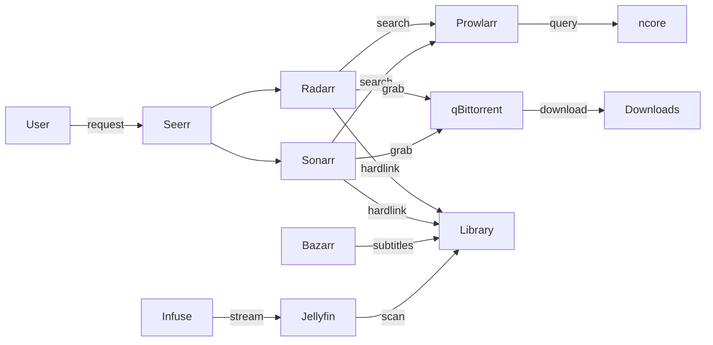

# Media Stack

Automated media server for requesting, downloading, organizing, and streaming movies and series. Content sourced from ncore.pro, streamed via Jellyfin + Infuse on Apple TV 4K.

## Contents

- [Architecture](#architecture)
- [Services](#services)
- [Storage layout](#storage-layout)
- [DNS setup](#dns-setup)
- [First-launch setup](#first-launch-setup)
- [Quality profiles (fallback)](#quality-profiles-fallback--manual-setup)
- [Recyclarr](#recyclarr)
- [Apple TV setup](#apple-tv-setup)
- [Maintenance](#maintenance)

## Architecture



## Services

| Service | Domain | Purpose |
|---------|--------|---------|
| Seerr | `media.lab.internal` | Request UI (main entry point) |
| Radarr | `radarr.media.lab.internal` | Movie management |
| Sonarr | `sonarr.media.lab.internal` | Series management |
| Prowlarr | `prowlarr.media.lab.internal` | Indexer manager |
| Bazarr | `bazarr.media.lab.internal` | Subtitle fetching |
| Jellyfin | `jellyfin.media.lab.internal` | Media server / library |
| qBittorrent | `downloads.lab.internal` | Torrent client |
| Recyclarr | — | TRaSH Guides config sync (no UI) |

## Storage layout

All services that touch media files mount the same `${MEDIA_ROOT}` at `/media` to enable hardlinks (files stored once on disk, appear in two locations).

```
${MEDIA_ROOT}/
├── downloads/
│   ├── movies/          ← qBittorrent downloads here
│   └── series/          ← qBittorrent downloads here
├── movies/              ← Radarr hardlinks completed movies here
└── series/              ← Sonarr hardlinks completed series here
```

## DNS setup

Two wildcard DNS records on the UniFi router, both pointing to the homelab IP:

- `*.lab.internal` → covers `downloads.lab.internal`
- `*.media.lab.internal` → covers all media service subdomains

## First-launch setup

After `dfs services start`, each service needs one-time manual configuration. Follow this order — later services depend on earlier ones.

### 1. qBittorrent

Visit `https://downloads.lab.internal`.

On first start, qBittorrent generates a random admin password. Retrieve it from logs:

```bash
docker logs qbittorrent 2>&1 | grep "temporary password"
```

Log in with username `admin` and the temporary password, then:

1. **Settings → Web UI → Authentication**: change the admin password. Store the new password in Bitwarden field `QBITTORRENT_PASSWORD` on the `dotfiles/homelab/mac` item (for reference only — not used in templates).
2. **Settings → Downloads → Default Torrent Management Mode**: set to **Automatic** (required for category save paths to work)
3. **Settings → Downloads → Default Save Path**: set to `/media/downloads`
4. **Settings → Downloads → Keep incomplete torrents in**: leave disabled
5. **Create download categories** (left sidebar → right-click → "New Category"):
   - Category: `movies`, Save Path: `/media/downloads/movies`
   - Category: `series`, Save Path: `/media/downloads/series`
6. **Settings → BitTorrent → Seeding Limits**: leave unchecked (seed indefinitely)

### 2. Radarr

Visit `https://radarr.media.lab.internal`.

1. **First-run**: create an admin account
2. **Settings → General → API Key**: copy this key and save it to Bitwarden field `RADARR_API_KEY` on the `dotfiles/homelab/mac` item
3. **Settings → Media Management → Root Folders → Add Root Folder**: `/media/movies`
4. **Settings → Download Clients → Add → qBittorrent**:
   - Host: `qbittorrent`
   - Port: `8080`
   - Username: `admin`
   - Password: the password you set in step 1
   - Category: `movies`
   - Test the connection
5. **Settings → Profiles → Quality Profile** (whichever profile you use):
   - Language: set to **Any** (ncore tags dual-audio hun/eng releases as Hungarian — "Any" ensures they aren't rejected)
6. **Settings → Connect → Add → Jellyfin**:
   - Host: `jellyfin`
   - Port: `8096`
   - API Key: create one in Jellyfin (Dashboard → API Keys)
   - Test and save
   - This notifies Jellyfin immediately when new content is imported (no manual library scan needed)

### 3. Sonarr

Visit `https://sonarr.media.lab.internal`.

1. **First-run**: create an admin account
2. **Settings → General → API Key**: copy this key and save it to Bitwarden field `SONARR_API_KEY` on the `dotfiles/homelab/mac` item
3. **Settings → Media Management → Root Folders → Add Root Folder**: `/media/series`
4. **Settings → Download Clients → Add → qBittorrent**:
   - Host: `qbittorrent`
   - Port: `8080`
   - Username: `admin`
   - Password: the password you set in step 1
   - Category: `series`
   - Test the connection
5. **Settings → Profiles → Quality Profile** (whichever profile you use):
   - Language: set to **Any** (same reason as Radarr)
6. **Settings → Connect → Add → Jellyfin**:
   - Host: `jellyfin`
   - Port: `8096`
   - API Key: same Jellyfin API key as Radarr
   - Test and save

### 4. Recyclarr

After Radarr and Sonarr API keys are in Bitwarden:

1. Re-render the Recyclarr config to inject the API keys:
   ```bash
   dfs services restart recyclarr
   ```
2. Run the first sync manually to verify:
   ```bash
   cd profiles/homelab/mac/ops/services/media/recyclarr
   docker compose run --rm recyclarr sync
   ```
3. Check Radarr/Sonarr quality definitions updated (Settings → Quality)

### 5. Prowlarr

Visit `https://prowlarr.media.lab.internal`.

1. **First-run**: create an admin account (username + password)
2. **Settings → Indexers → Add Indexer**: search for "ncore"
   - Enter your ncore username and password
   - Enter your ncore passkey (found in your ncore.pro profile under RSS/passkey section)
   - Test the connection
3. **Settings → Apps → Add Application → Radarr**:
   - Prowlarr Server: `http://prowlarr:9696`
   - Radarr Server: `http://radarr:7878`
   - API Key: paste the Radarr API key
4. **Settings → Apps → Add Application → Sonarr**:
   - Prowlarr Server: `http://prowlarr:9696`
   - Sonarr Server: `http://sonarr:8989`
   - API Key: paste the Sonarr API key

### 6. Bazarr

Visit `https://bazarr.media.lab.internal`.

1. **First-run**: create an admin account
2. **Settings → Sonarr**: connect to Sonarr
   - Address: `sonarr`
   - Port: `8989`
   - API Key: paste the Sonarr API key
   - Test and save
3. **Settings → Radarr**: connect to Radarr
   - Address: `radarr`
   - Port: `7878`
   - API Key: paste the Radarr API key
   - Test and save
4. **Settings → Languages**:
   - Languages Filter: add **English** and **Hungarian**
   - Languages Profile: click "Add New Profile", name it (e.g., "Default"), add **English** and **Hungarian**
   - Default Language Profiles For Newly Added Shows: check **Series**, select the profile
   - Default Language Profiles For Newly Added Movies: check **Movies**, select the profile
5. **Settings → Providers → Add**: configure subtitle providers
   - **OpenSubtitles.com**: create a free account at opensubtitles.com, add API key
   - **subdl**: good alternative for Hungarian subtitles
   - Enable any additional providers as desired

### 7. Jellyfin

Visit `https://jellyfin.media.lab.internal`.

1. **First-run wizard**:
   - Create admin user (username + password)
   - Preferred display language: English (or Hungarian)
   - Skip "Setup your media libraries" for now — we'll add them next
   - Allow remote connections: yes
   - Finish wizard
2. **Dashboard → Libraries → Add Media Library**:
   - Content type: Movies
   - Display name: Movies
   - Folders: `/media/movies`
   - Preferred language: English
   - Country: Hungary
3. **Dashboard → Libraries → Add Media Library**:
   - Content type: Shows
   - Display name: Series
   - Folders: `/media/series`
   - Preferred language: English
   - Country: Hungary
4. **Dashboard → API Keys → Create**: create an API key for Radarr/Sonarr integration (used in their Connect settings)
5. **Dashboard → Scheduled Tasks → Scan All Libraries**: run manually for initial scan

### 8. Seerr

Visit `https://media.lab.internal`.

1. **First-run wizard**:
   - Sign in method: choose Jellyfin
   - Jellyfin URL: `http://jellyfin:8096`
   - Sign in with your Jellyfin admin credentials
2. **Settings → Jellyfin**: libraries should be auto-discovered. Enable Movies and Series.
3. **Settings → Radarr**:
   - Default Server: yes
   - Server Name: Radarr
   - Hostname: `radarr`
   - Port: `7878`
   - API Key: paste the Radarr API key
   - Quality Profile: **UHD Bluray + WEB** (created by Recyclarr)
   - Root Folder: `/media/movies`
   - Test and save
4. **Settings → Sonarr**:
   - Default Server: yes
   - Server Name: Sonarr
   - Hostname: `sonarr`
   - Port: `8989`
   - API Key: paste the Sonarr API key
   - Quality Profile: **WEB-2160p** (created by Recyclarr)
   - Root Folder: `/media/series`
   - Test and save

## Quality profiles (fallback — manual setup)

Recyclarr handles quality profile configuration automatically. This section is a **fallback** for manual setup if Recyclarr is not used or for reference on what the profiles should look like.

### Radarr quality profile

In Radarr → Settings → Profiles → edit the default profile (or create a new one named "Ultra-HD"):

**Quality ranking (top = most preferred):**

1. Remux-2160p
2. Bluray-2160p
3. WEB 2160p (WEBDL-2160p + WEBRip-2160p)
4. Remux-1080p
5. Bluray-1080p
6. WEB 1080p (WEBDL-1080p + WEBRip-1080p)

Uncheck everything below WEB 1080p (720p, DVD, etc.)

**Upgrade Until Quality:** Remux-2160p
**Upgrade Until Custom Format Score:** 10000 (allow upgrades)

### Custom formats (Radarr)

In Settings → Custom Formats, add these for scoring:

| Custom Format | Score | Purpose |
|---------------|-------|---------|
| DV (Dolby Vision) | 1500 | Prefer Dolby Vision |
| DV HDR10Plus | 1600 | DV + HDR10+ combo |
| HDR10Plus | 600 | Prefer HDR10+ |
| HDR10 | 500 | Prefer HDR10 |
| Multi (Hungarian) | 2000 | Strongly prefer Hungarian audio |

### Sonarr quality profile

Same structure as Radarr — create or edit the profile with the same quality ranking and custom format scores.

### Recyclarr sync

After manual profiles are working, codify them in `recyclarr.yml.tmpl`. Run `docker compose run --rm recyclarr list custom-formats radarr` to discover TRaSH Guide IDs, then update the config to include `custom_formats` and `quality_profiles` sections. See [Recyclarr config reference](https://recyclarr.dev/wiki/yaml/config-reference/) for the full syntax.

## Apple TV setup

Jellyfin exposes port 8096 directly (in addition to HTTPS via Caddy) so that Infuse on Apple TV can connect over HTTP without needing to trust the Caddy CA. Apple TV 4K has no USB-C port, making CA trust installation impractical.

### Configure Infuse

1. Open Infuse on Apple TV
2. Add Share → **Jellyfin**
3. Server: `http://jellyfin.media.lab.internal:8096`
4. Sign in with your Jellyfin credentials
5. Libraries should appear automatically

Browser access at `https://jellyfin.media.lab.internal` continues to work through Caddy with HTTPS as before.

## Maintenance

### Disk space

qBittorrent seeds indefinitely. Completed torrents stay in `${MEDIA_ROOT}/downloads/` while hardlinked copies exist in `${MEDIA_ROOT}/movies/` and `${MEDIA_ROOT}/series/`. Since hardlinks share disk blocks, files are stored once.

To free space: remove old torrents from qBittorrent's web UI. The library copy remains (hardlink becomes a regular file when the download copy is deleted).

### Moving to external HDD

1. Update `MEDIA_ROOT` in Bitwarden to the new mount path (e.g., `/Volumes/MediaHDD/media`)
2. Copy or move existing media: `rsync -avH ${OLD_PATH}/ ${NEW_PATH}/` (the `-H` flag preserves hardlinks)
3. Re-render templates: `dfs services init`
4. Restart all media + download services: `dfs services restart`

### Recyclarr updates

Recyclarr syncs TRaSH Guides daily via cron. To force an immediate sync:

```bash
cd profiles/homelab/mac/ops/services/media/recyclarr
docker compose run --rm recyclarr sync
```
